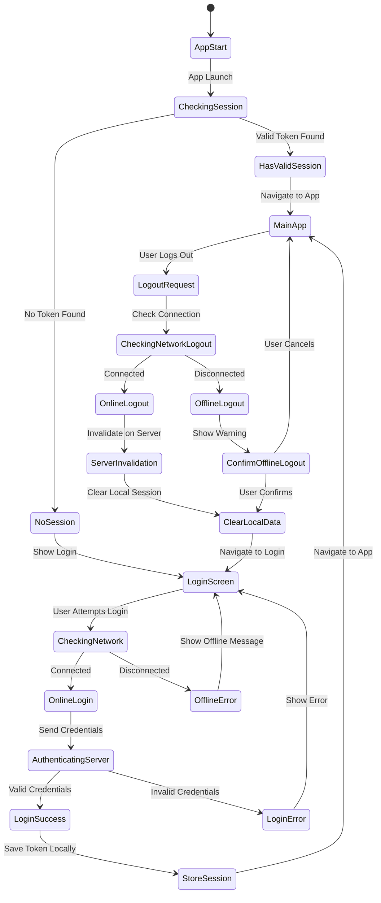

# Bowpi Authentication Offline-First Behavior

## Overview

This document describes the offline-first authentication behavior implemented in the Bowpi authentication system. The system is designed to provide maximum functionality even when network connectivity is limited or unavailable, which is crucial for field agents working in areas with poor internet connectivity.

## Table of Contents

1. [Offline-First Principles](#offline-first-principles)
2. [Authentication Flow States](#authentication-flow-states)
3. [Login Behavior](#login-behavior)
4. [Session Management](#session-management)
5. [Logout Behavior](#logout-behavior)
6. [Network State Handling](#network-state-handling)
7. [Data Synchronization](#data-synchronization)
8. [Error Handling](#error-handling)
9. [User Experience Guidelines](#user-experience-guidelines)
10. [Implementation Details](#implementation-details)

## Offline-First Principles

### Core Principles

1. **Connectivity Independence**: The app should function fully offline after initial authentication
2. **Data Persistence**: All user data and session information persists across app restarts
3. **Graceful Degradation**: Features that require network connectivity fail gracefully with clear user feedback
4. **Optimistic Updates**: Local changes are made immediately, synchronized when connectivity is restored
5. **Conflict Resolution**: Handle data conflicts when synchronizing after offline periods

### Design Philosophy

```
Online-First (Traditional)          Offline-First (Bowpi)
┌─────────────────────┐            ┌─────────────────────┐
│   Network Required  │            │   Network Optional  │
│   for All Actions   │     vs     │   for Most Actions  │
│                     │            │                     │
│   Poor UX Offline   │            │   Full UX Offline   │
└─────────────────────┘            └─────────────────────┘
```

## Authentication Flow States

### State Diagram



### State Definitions

| State | Description | Network Required | User Actions Available |
|-------|-------------|------------------|----------------------|
| **AppStart** | Initial app launch | No | None |
| **CheckingSession** | Validating stored session | No | None |
| **HasValidSession** | Valid session found locally | No | Navigate to app |
| **NoSession** | No valid session found | No | Show login screen |
| **LoginScreen** | User can enter credentials | No | Enter credentials, forgot password |
| **OnlineLogin** | Network available for login | Yes | Authenticate with server |
| **OfflineError** | Login attempted without network | No | Retry when online |
| **MainApp** | Full app functionality | No | All app features, logout |
| **OnlineLogout** | Logout with network | Yes | Server invalidation |
| **OfflineLogout** | Logout without network | No | Local logout with warning |

## Login Behavior

### Online Login Flow

```typescript
// Online login sequence
const onlineLoginFlow = async (email: string, password: string) => {
  // 1. Validate network connectivity
  const netInfo = await NetInfo.fetch();
  if (!netInfo.isConnected) {
    throw new BowpiAuthError(
      BowpiAuthErrorType.OFFLINE_LOGIN_ATTEMPT,
      'Login requires internet connection'
    );
  }

  // 2. Send authentication request to server
  const response = await httpClient.post('/auth/login', {
    username: email,
    password: password,
    application: 'MOBILE',
    isCheckVersion: false
  });

  // 3. Process server response
  if (response.success) {
    const decryptedData = BowpiCryptoService.decryptToken(response.data);
    
    // 4. Store session data locally
    await storeSessionData({
      decryptedToken: decryptedData,
      lastRenewalDate: Date.now(),
      userId: decryptedData.userId,
      userProfile: decryptedData.userProfile,
      sessionId: decryptedData.userId,
      expirationTime: Date.now() + (365 * 24 * 60 * 60 * 1000) // 1 year
    });

    // 5. Navigate to main app
    return { success: true, userData: decryptedData };
  }
};
```

### Offline Login Attempt

```typescript
// Offline login handling
const handleOfflineLogin = async () => {
  // Show user-friendly message
  Alert.alert(
    'Sin Conexión a Internet',
    'Para iniciar sesión necesitas conexión a internet. Una vez que inicies sesión, podrás usar la aplicación sin conexión.',
    [
      {
        text: 'Entendido',
        style: 'default'
      },
      {
        text: 'Reintentar',
        onPress: () => checkNetworkAndRetry()
      }
    ]
  );
};

const checkNetworkAndRetry = async () => {
  const netInfo = await NetInfo.fetch();
  if (netInfo.isConnected) {
    // Network is now available, allow login attempt
    setNetworkAvailable(true);
  } else {
    // Still offline
    setTimeout(checkNetworkAndRetry, 2000); // Check again in 2 seconds
  }
};
```

### Session Restoration on App Start

```typescript
// App startup session check
const restoreSessionOnStartup = async () => {
  try {
    // 1. Check for stored session data
    const sessionData = await getStoredSessionData();
    
    if (!sessionData) {
      // No session found, show login
      navigateToLogin();
      return;
    }

    // 2. Validate session data integrity
    if (!sessionData.userId || !sessionData.sessionId) {
      // Corrupted session, clear and show login
      await clearSessionData();
      navigateToLogin();
      return;
    }

    // 3. Session is valid, restore user state
    authStore.setState({
      isAuthenticated: true,
      user: sessionData.decryptedToken,
      sessionId: sessionData.sessionId
    });

    // 4. Navigate to main app
    navigateToMainApp();

    // 5. Attempt background sync if online
    const netInfo = await NetInfo.fetch();
    if (netInfo.isConnected) {
      backgroundSync();
    }

  } catch (error) {
    console.error('Session restoration failed:', error);
    await clearSessionData();
    navigateToLogin();
  }
};
```

## Session Management

### Session Persistence Strategy

```typescript
// Session data structure
interface BowpiSessionData {
  decryptedToken: AuthTokenData;
  lastRenewalDate: number;
  userId: string;
  userProfile: AuthTokenData['userProfile'];
  sessionId: string;
  expirationTime: number; // Not enforced for offline-first
  offlineCapabilities: {
    canCreateApplications: boolean;
    canViewApplications: boolean;
    canEditApplications: boolean;
    lastSyncTimestamp: number;
  };
}
```

### Session Validation Rules

1. **No Expiration Enforcement**: Sessions don't expire automatically (offline-first requirement)
2. **Integrity Checks**: Validate session data structure and required fields
3. **Corruption Recovery**: Clear corrupted sessions and require re-authentication
4. **Background Validation**: Validate session with server when online (optional)

```typescript
const validateStoredSession = async (): Promise<boolean> => {
  try {
    const sessionData = await getStoredSessionData();
    
    // Check if session exists
    if (!sessionData) return false;
    
    // Validate required fields
    const requiredFields = ['userId', 'sessionId', 'decryptedToken'];
    for (const field of requiredFields) {
      if (!sessionData[field]) {
        console.warn(`Session validation failed: missing ${field}`);
        return false;
      }
    }
    
    // Validate token structure
    const token = sessionData.decryptedToken;
    if (!token.userProfile || !token.userProfile.requestId) {
      console.warn('Session validation failed: invalid token structure');
      return false;
    }
    
    // Session is valid for offline use
    return true;
    
  } catch (error) {
    console.error('Session validation error:', error);
    return false;
  }
};
```

### Background Session Sync

```typescript
const backgroundSessionSync = async () => {
  try {
    const netInfo = await NetInfo.fetch();
    if (!netInfo.isConnected) return;
    
    const sessionData = await getStoredSessionData();
    if (!sessionData) return;
    
    // Optional: Validate session with server
    // This is not required for offline-first, but can help detect revoked sessions
    try {
      const response = await httpClient.get('/auth/validate-session', {
        timeout: 5000 // Short timeout for background operation
      });
      
      if (!response.success) {
        // Session is invalid on server, but don't force logout
        // Log the event for monitoring
        console.warn('Server session validation failed, but continuing offline');
      }
    } catch (error) {
      // Network error or timeout, ignore for offline-first
      console.log('Background session sync failed, continuing offline');
    }
    
  } catch (error) {
    console.error('Background session sync error:', error);
  }
};
```

## Logout Behavior

### Online Logout Flow

```typescript
const onlineLogoutFlow = async () => {
  try {
    const sessionData = await getStoredSessionData();
    if (!sessionData) return;
    
    // 1. Invalidate session on server (fire-and-forget)
    try {
      await httpClient.post(
        `/management/session/invalidate/request/${sessionData.userId}`,
        {},
        { timeout: 10000 }
      );
      console.log('Server session invalidated successfully');
    } catch (error) {
      // Don't fail logout if server invalidation fails
      console.warn('Server session invalidation failed:', error.message);
    }
    
    // 2. Clear local session data
    await clearAllSessionData();
    
    // 3. Update app state
    authStore.setState({
      isAuthenticated: false,
      user: null,
      sessionId: null
    });
    
    // 4. Navigate to login
    navigateToLogin();
    
  } catch (error) {
    console.error('Online logout error:', error);
    // Still clear local data even if server call fails
    await clearAllSessionData();
    navigateToLogin();
  }
};
```

### Offline Logout Flow

```typescript
const offlineLogoutFlow = async () => {
  // Show warning to user about offline logout implications
  Alert.alert(
    'Cerrar Sesión Sin Conexión',
    'No tienes conexión a internet. Si cierras sesión ahora, no podrás volver a iniciar sesión hasta que tengas conexión a internet.\n\n¿Estás seguro de que deseas continuar?',
    [
      {
        text: 'Cancelar',
        style: 'cancel'
      },
      {
        text: 'Cerrar Sesión',
        style: 'destructive',
        onPress: async () => {
          // Clear local session data
          await clearAllSessionData();
          
          // Update app state
          authStore.setState({
            isAuthenticated: false,
            user: null,
            sessionId: null
          });
          
          // Navigate to login
          navigateToLogin();
          
          // Show additional message about needing internet for next login
          setTimeout(() => {
            Alert.alert(
              'Sesión Cerrada',
              'Tu sesión ha sido cerrada localmente. Necesitarás conexión a internet para volver a iniciar sesión.',
              [{ text: 'Entendido' }]
            );
          }, 500);
        }
      }
    ]
  );
};
```

### Automatic Logout Scenarios

```typescript
// Automatic logout only occurs in specific scenarios
const handleAuthenticationError = async (error: any) => {
  // Only auto-logout on authentication errors when online
  if ((error.status === 401 || error.status === 403)) {
    const netInfo = await NetInfo.fetch();
    
    if (netInfo.isConnected) {
      // Online: Server says session is invalid, logout
      console.log('Authentication error while online, logging out');
      await onlineLogoutFlow();
    } else {
      // Offline: Don't logout, session might be valid
      console.log('Authentication error while offline, continuing with cached session');
      // Could show a warning to user about potential session issues
      showSessionWarning();
    }
  }
};

const showSessionWarning = () => {
  // Optional: Show non-intrusive warning about potential session issues
  Toast.show({
    type: 'warning',
    text1: 'Advertencia de Sesión',
    text2: 'Puede que tu sesión haya expirado. Conéctate a internet para verificar.',
    visibilityTime: 5000,
  });
};
```

## Network State Handling

### Network State Monitoring

```typescript
// Comprehensive network state monitoring
const setupNetworkMonitoring = () => {
  // Listen for network state changes
  const unsubscribe = NetInfo.addEventListener(state => {
    const wasConnected = networkState.isConnected;
    const isNowConnected = state.isConnected ?? false;
    
    // Update network state
    setNetworkState({
      isConnected: isNowConnected,
      type: state.type,
      isInternetReachable: state.isInternetReachable,
      details: state.details
    });
    
    // Handle connection state changes
    if (!wasConnected && isNowConnected) {
      handleNetworkReconnection();
    } else if (wasConnected && !isNowConnected) {
      handleNetworkDisconnection();
    }
  });
  
  return unsubscribe;
};

const handleNetworkReconnection = async () => {
  console.log('Network reconnected, starting background sync');
  
  // Show connection restored message
  Toast.show({
    type: 'success',
    text1: 'Conexión Restaurada',
    text2: 'Sincronizando datos...',
    visibilityTime: 3000,
  });
  
  // Start background synchronization
  try {
    await backgroundSync();
    await backgroundSessionSync();
  } catch (error) {
    console.error('Background sync failed after reconnection:', error);
  }
};

const handleNetworkDisconnection = () => {
  console.log('Network disconnected, entering offline mode');
  
  // Show offline mode message
  Toast.show({
    type: 'info',
    text1: 'Modo Sin Conexión',
    text2: 'Puedes seguir usando la aplicación. Los datos se sincronizarán cuando tengas conexión.',
    visibilityTime: 4000,
  });
};
```

### Network-Aware UI Components

```typescript
// Network status indicator component
const NetworkStatusIndicator: React.FC = () => {
  const [networkState, setNetworkState] = useState<NetworkState>({
    isConnected: true,
    type: 'unknown'
  });

  useEffect(() => {
    const unsubscribe = NetInfo.addEventListener(setNetworkState);
    return unsubscribe;
  }, []);

  if (networkState.isConnected) {
    return (
      <View style={styles.onlineIndicator}>
        <Icon name="wifi" color="green" size={16} />
        <Text style={styles.onlineText}>En línea</Text>
      </View>
    );
  }

  return (
    <View style={styles.offlineIndicator}>
      <Icon name="wifi-off" color="orange" size={16} />
      <Text style={styles.offlineText}>Sin conexión</Text>
    </View>
  );
};

// Network-aware button component
const NetworkAwareButton: React.FC<{
  onPress: () => void;
  requiresNetwork?: boolean;
  title: string;
}> = ({ onPress, requiresNetwork = false, title }) => {
  const [isConnected, setIsConnected] = useState(true);

  useEffect(() => {
    const unsubscribe = NetInfo.addEventListener(state => {
      setIsConnected(state.isConnected ?? false);
    });
    return unsubscribe;
  }, []);

  const handlePress = () => {
    if (requiresNetwork && !isConnected) {
      Alert.alert(
        'Sin Conexión',
        'Esta acción requiere conexión a internet.',
        [{ text: 'Entendido' }]
      );
      return;
    }
    onPress();
  };

  return (
    <Button
      title={title}
      onPress={handlePress}
      disabled={requiresNetwork && !isConnected}
      style={[
        styles.button,
        requiresNetwork && !isConnected && styles.disabledButton
      ]}
    />
  );
};
```

## Data Synchronization

### Sync Strategy

```typescript
// Data synchronization strategy
interface SyncOperation {
  id: string;
  type: 'CREATE' | 'UPDATE' | 'DELETE';
  entity: 'APPLICATION' | 'DOCUMENT' | 'USER_PROFILE';
  data: any;
  timestamp: number;
  retryCount: number;
  status: 'PENDING' | 'IN_PROGRESS' | 'COMPLETED' | 'FAILED';
}

class OfflineSyncManager {
  private pendingOperations: SyncOperation[] = [];
  private syncInProgress = false;

  async queueOperation(operation: Omit<SyncOperation, 'id' | 'timestamp' | 'retryCount' | 'status'>) {
    const syncOp: SyncOperation = {
      ...operation,
      id: generateUniqueId(),
      timestamp: Date.now(),
      retryCount: 0,
      status: 'PENDING'
    };

    this.pendingOperations.push(syncOp);
    await this.persistPendingOperations();

    // Try to sync immediately if online
    const netInfo = await NetInfo.fetch();
    if (netInfo.isConnected && !this.syncInProgress) {
      this.startSync();
    }
  }

  async startSync() {
    if (this.syncInProgress) return;
    
    const netInfo = await NetInfo.fetch();
    if (!netInfo.isConnected) return;

    this.syncInProgress = true;

    try {
      const pendingOps = this.pendingOperations.filter(op => 
        op.status === 'PENDING' || op.status === 'FAILED'
      );

      for (const operation of pendingOps) {
        await this.syncOperation(operation);
      }

      // Remove completed operations
      this.pendingOperations = this.pendingOperations.filter(op => 
        op.status !== 'COMPLETED'
      );

      await this.persistPendingOperations();

    } catch (error) {
      console.error('Sync error:', error);
    } finally {
      this.syncInProgress = false;
    }
  }

  private async syncOperation(operation: SyncOperation) {
    try {
      operation.status = 'IN_PROGRESS';

      let response;
      switch (operation.type) {
        case 'CREATE':
          response = await httpClient.post(`/api/${operation.entity.toLowerCase()}`, operation.data);
          break;
        case 'UPDATE':
          response = await httpClient.put(`/api/${operation.entity.toLowerCase()}/${operation.data.id}`, operation.data);
          break;
        case 'DELETE':
          response = await httpClient.delete(`/api/${operation.entity.toLowerCase()}/${operation.data.id}`);
          break;
      }

      if (response.success) {
        operation.status = 'COMPLETED';
        console.log(`Sync completed for operation ${operation.id}`);
      } else {
        throw new Error(`Server returned error: ${response.message}`);
      }

    } catch (error) {
      operation.retryCount++;
      
      if (operation.retryCount >= 3) {
        operation.status = 'FAILED';
        console.error(`Sync failed permanently for operation ${operation.id}:`, error);
      } else {
        operation.status = 'PENDING';
        console.warn(`Sync failed for operation ${operation.id}, will retry:`, error);
      }
    }
  }

  private async persistPendingOperations() {
    await AsyncStorage.setItem(
      '@bowpi_pending_sync_operations',
      JSON.stringify(this.pendingOperations)
    );
  }

  async loadPendingOperations() {
    try {
      const stored = await AsyncStorage.getItem('@bowpi_pending_sync_operations');
      if (stored) {
        this.pendingOperations = JSON.parse(stored);
      }
    } catch (error) {
      console.error('Failed to load pending operations:', error);
    }
  }
}
```

## Error Handling

### Offline-Specific Error Handling

```typescript
// Error handling for offline scenarios
class OfflineErrorHandler {
  static handleNetworkError(error: any, operation: string): void {
    if (this.isNetworkError(error)) {
      // Network error during offline operation
      Toast.show({
        type: 'info',
        text1: 'Sin Conexión',
        text2: `${operation} se guardará y sincronizará cuando tengas conexión.`,
        visibilityTime: 4000,
      });
    } else {
      // Other error
      Toast.show({
        type: 'error',
        text1: 'Error',
        text2: `Error en ${operation}. Intenta nuevamente.`,
        visibilityTime: 3000,
      });
    }
  }

  static handleAuthError(error: any): void {
    if (error.status === 401 || error.status === 403) {
      // Authentication error
      Alert.alert(
        'Sesión Expirada',
        'Tu sesión puede haber expirado. ¿Deseas intentar reconectarte?',
        [
          {
            text: 'Continuar Sin Conexión',
            style: 'cancel'
          },
          {
            text: 'Reconectar',
            onPress: () => this.attemptReconnection()
          }
        ]
      );
    }
  }

  private static async attemptReconnection(): Promise<void> {
    const netInfo = await NetInfo.fetch();
    if (netInfo.isConnected) {
      // Try to refresh session
      try {
        await backgroundSessionSync();
        Toast.show({
          type: 'success',
          text1: 'Reconectado',
          text2: 'Tu sesión ha sido verificada.',
        });
      } catch (error) {
        // Session is invalid, need to re-login
        Alert.alert(
          'Sesión Inválida',
          'Necesitas iniciar sesión nuevamente.',
          [
            {
              text: 'Iniciar Sesión',
              onPress: () => navigateToLogin()
            }
          ]
        );
      }
    } else {
      Alert.alert(
        'Sin Conexión',
        'No se puede verificar tu sesión sin conexión a internet.',
        [{ text: 'Entendido' }]
      );
    }
  }

  private static isNetworkError(error: any): boolean {
    return (
      error.code === 'NETWORK_ERROR' ||
      error.message?.includes('Network request failed') ||
      error.message?.includes('timeout') ||
      !error.status // No HTTP status usually means network error
    );
  }
}
```

## User Experience Guidelines

### Offline UX Principles

1. **Clear Status Communication**: Always inform users about their connection status
2. **Graceful Degradation**: Features work offline or provide clear alternatives
3. **Optimistic Updates**: Show changes immediately, sync in background
4. **Helpful Error Messages**: Explain what happened and what users can do
5. **Progress Indication**: Show sync progress when reconnecting

### UI/UX Patterns

#### Connection Status Banner

```typescript
const ConnectionStatusBanner: React.FC = () => {
  const [isConnected, setIsConnected] = useState(true);
  const [syncInProgress, setSyncInProgress] = useState(false);

  return (
    <>
      {!isConnected && (
        <View style={styles.offlineBanner}>
          <Icon name="wifi-off" color="white" size={16} />
          <Text style={styles.bannerText}>
            Trabajando sin conexión. Los datos se sincronizarán automáticamente.
          </Text>
        </View>
      )}
      
      {isConnected && syncInProgress && (
        <View style={styles.syncBanner}>
          <ActivityIndicator size="small" color="white" />
          <Text style={styles.bannerText}>
            Sincronizando datos...
          </Text>
        </View>
      )}
    </>
  );
};
```

#### Offline Action Feedback

```typescript
const OfflineActionFeedback: React.FC<{
  action: string;
  onRetry?: () => void;
}> = ({ action, onRetry }) => {
  return (
    <View style={styles.feedbackContainer}>
      <Icon name="cloud-off" size={24} color="orange" />
      <Text style={styles.feedbackTitle}>Acción Guardada</Text>
      <Text style={styles.feedbackMessage}>
        {action} se ha guardado localmente y se sincronizará cuando tengas conexión.
      </Text>
      {onRetry && (
        <Button
          title="Reintentar Ahora"
          onPress={onRetry}
          style={styles.retryButton}
        />
      )}
    </View>
  );
};
```

## Implementation Details

### Key Configuration

```typescript
// Offline-first configuration
export const OFFLINE_CONFIG = {
  // Session management
  SESSION_NEVER_EXPIRES: true, // Sessions don't expire offline
  VALIDATE_SESSION_ONLINE: false, // Don't require online validation
  
  // Sync settings
  AUTO_SYNC_ON_RECONNECT: true,
  SYNC_RETRY_ATTEMPTS: 3,
  SYNC_RETRY_DELAY: 5000, // 5 seconds
  
  // Storage settings
  ENCRYPT_OFFLINE_DATA: true,
  COMPRESS_STORED_DATA: true,
  
  // UI settings
  SHOW_CONNECTION_STATUS: true,
  SHOW_SYNC_PROGRESS: true,
  OFFLINE_BANNER_TIMEOUT: 10000, // 10 seconds
};
```

### Storage Schema for Offline Data

```typescript
// Offline storage schema
interface OfflineStorageSchema {
  // Authentication data
  session: BowpiSessionData;
  userProfile: AuthTokenData['userProfile'];
  
  // Application data
  applications: ApplicationData[];
  documents: DocumentData[];
  
  // Sync data
  pendingOperations: SyncOperation[];
  lastSyncTimestamp: number;
  
  // Configuration
  offlineConfig: typeof OFFLINE_CONFIG;
  appVersion: string;
}
```

### Performance Considerations

1. **Lazy Loading**: Load data on demand to reduce memory usage
2. **Data Compression**: Compress stored data to save space
3. **Efficient Queries**: Use indexed queries for fast data retrieval
4. **Background Processing**: Perform sync operations in background
5. **Memory Management**: Clean up unused data regularly

---

**Last Updated**: January 2025  
**Version**: 1.0  
**Maintainer**: CrediBowpi Development Team