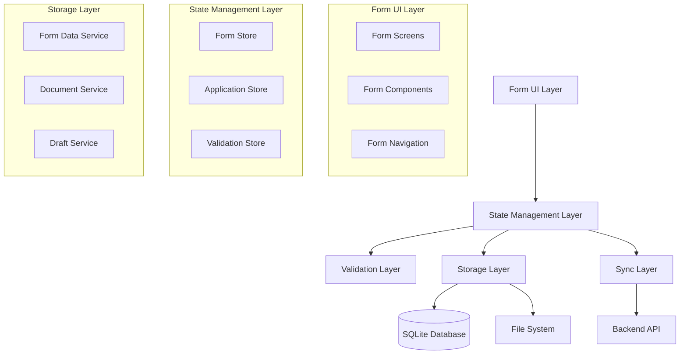
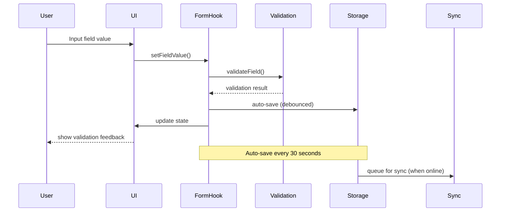

# Design Document

## Overview

The Credit Application Form System is a comprehensive, multi-stage form solution designed for CrediBowpi Mobile. The system implements a 6-stage process with free navigation, real-time auto-save, live validations, and offline-first capabilities. The design leverages the existing form infrastructure while extending it to support the complex requirements of credit application processing.

The system is built on React Native with TypeScript, utilizing the existing atomic design system, Zustand for state management, SQLite for offline storage, and a robust validation framework using Zod schemas.

## Architecture

### High-Level Architecture



### Component Architecture

The system follows the existing atomic design pattern:

- **Atoms**: Basic form inputs (TextInput, Select, DatePicker, CurrencyInput)
- **Molecules**: Composite form elements (FormField, SectionHeader, ProgressIndicator)
- **Organisms**: Complex form sections (FormSection, NavigationHeader, ActionBar)
- **Templates**: Form layout templates (FormTemplate, ReviewTemplate)
- **Pages**: Complete form screens (ApplicationFormScreen, ReviewScreen)

### Data Flow Architecture



## Components and Interfaces

### Core Form Components

#### 1. ApplicationFormScreen
Main screen component that orchestrates the entire form experience.

```typescript
interface ApplicationFormScreenProps {
  applicationId?: string; // undefined for new applications
  initialSection?: string;
  onComplete?: (applicationId: string) => void;
  onExit?: () => void;
}
```

#### 2. FormNavigationHeader
Dynamic header with section selector and progress indication.

```typescript
interface FormNavigationHeaderProps {
  sections: FormSection[];
  currentSection: string;
  onSectionChange: (sectionId: string) => void;
  applicationName: string;
  applicationId: string;
  onExit: () => void;
}
```

#### 3. FormSectionRenderer
Renders the current form section with appropriate fields and layout.

```typescript
interface FormSectionRendererProps {
  section: FormSectionSchema;
  formData: Record<string, any>;
  onFieldChange: (fieldName: string, value: any) => void;
  errors: Record<string, string>;
  isVisible: (fieldName: string) => boolean;
  isEnabled: (fieldName: string) => boolean;
}
```

#### 4. FormActionBar
Sticky bottom bar with navigation and save controls.

```typescript
interface FormActionBarProps {
  canNavigatePrevious: boolean;
  canNavigateNext: boolean;
  onPrevious: () => void;
  onNext: () => void;
  onSave: () => void;
  isSaving: boolean;
  showSubmit: boolean;
  onSubmit: () => void;
}
```

### Specialized Form Fields

#### 1. DPIInput
Specialized input for Guatemalan DPI format with real-time validation.

```typescript
interface DPIInputProps extends BaseInputProps {
  format: '0000 00000 0000';
  validateRealTime: boolean;
}
```

#### 2. PhoneInput
Phone number input with Guatemalan format validation.

```typescript
interface PhoneInputProps extends BaseInputProps {
  format: '0000 0000';
  countryCode: '+502';
}
```

#### 3. CurrencyInput
Currency input with Guatemalan Quetzal formatting.

```typescript
interface CurrencyInputProps extends BaseInputProps {
  currency: 'GTQ';
  symbol: 'Q';
  decimalPlaces: 2;
}
```

#### 4. DynamicListInput
For managing variable-length lists (products, guarantors).

```typescript
interface DynamicListInputProps<T> {
  items: T[];
  onItemAdd: () => void;
  onItemRemove: (index: number) => void;
  onItemChange: (index: number, item: T) => void;
  renderItem: (item: T, index: number) => React.ReactNode;
  minItems: number;
  maxItems: number;
}
```

### Document Management Components

#### 1. DocumentUploader
Handles document capture and upload with camera integration.

```typescript
interface DocumentUploaderProps {
  documentType: DocumentType;
  onDocumentCapture: (document: DocumentCapture) => void;
  onDocumentRemove: (documentId: string) => void;
  existingDocuments: DocumentCapture[];
  required: boolean;
}
```

#### 2. CameraCapture
Native camera integration for document capture.

```typescript
interface CameraCaptureProps {
  onCapture: (imageUri: string) => void;
  onCancel: () => void;
  documentType: DocumentType;
  quality: number;
}
```

## Data Models

### Form Schema Extensions

Building on the existing form schema, we extend it for credit applications:

```typescript
interface CreditApplicationFormSchema extends FormSchema {
  sections: [
    IdentificationSection,
    FinancesSection,
    BusinessSection,
    GuarantorsSection,
    DocumentsSection,
    ReviewSection
  ];
  calculations: FormCalculation[];
  conditionalLogic: ConditionalLogicRule[];
  validationRules: ValidationRule[];
}

interface FormCalculation {
  id: string;
  name: string;
  formula: string;
  dependsOn: string[];
  outputField: string;
  format: 'currency' | 'percentage' | 'number';
}

interface ConditionalLogicRule {
  id: string;
  condition: LogicalExpression;
  actions: ConditionalAction[];
}

interface ValidationRule {
  id: string;
  field: string;
  rule: ValidationRuleType;
  message: string;
  severity: 'error' | 'warning' | 'info';
}
```

### Application Data Structure

```typescript
interface CreditApplicationData {
  // Basic information
  id: string;
  agentId: string;
  status: ApplicationStatus;
  createdAt: Date;
  updatedAt: Date;
  
  // Form sections data
  identification: IdentificationData;
  finances: FinancesData;
  business: BusinessData;
  guarantors: GuarantorData[];
  documents: DocumentData[];
  review: ReviewData;
  
  // Metadata
  completionPercentage: number;
  currentSection: string;
  lastSavedAt: Date;
  syncStatus: SyncStatus;
}

interface IdentificationData {
  // Personal information
  firstName: string;
  lastName: string;
  gender: 'male' | 'female';
  civilStatus: 'single' | 'married' | 'divorced' | 'widowed' | 'common_law';
  dpi: string;
  nit?: string;
  dpiIssuedIn: string;
  
  // Spouse information (conditional)
  spouseName?: string;
  spouseWorkActivity?: string;
  
  // Contact information
  mobilePhone: string;
  homePhone?: string;
  email: string;
  address: string;
  addressReference?: string;
  gpsLocation: {
    latitude: number;
    longitude: number;
  };
  residenceDepartment: string;
  residenceMunicipality: string;
  housingType: 'owned' | 'rented' | 'family' | 'mortgaged' | 'other';
  housingStability: '1_year' | '2_years' | '3_years' | '5_years' | 'more_5_years';
}

interface FinancesData {
  // Income
  primaryIncomeSource: string;
  primaryIncome: number;
  secondaryIncome?: number;
  incomeComment: string;
  
  // Expenses (10 categories)
  expenses: {
    food: number;
    clothing: number;
    basicServices: number;
    education: number;
    housing: number;
    transportation: number;
    commitments: number;
    financialExpenses: number;
    payrollDeductions: number;
    others: number;
  };
  
  // Requested amount
  requestedAmount: number;
  
  // Calculated fields
  totalIncome: number;
  totalExpenses: number;
  availability: number;
  coveragePercentage: number;
  riskLevel: 'green' | 'yellow' | 'red';
  
  // Patrimony
  assets: {
    cashAndBanks: number;
    accountsReceivable: number;
    merchandise: number;
    movableGoods: number;
    vehicles: number;
    realEstate: number;
    otherAssets: number;
  };
  
  liabilities: {
    accountsPayable: number;
    shortTermDebts: number;
    longTermLoans: number;
  };
  
  // Calculated patrimony fields
  totalAssets: number;
  totalLiabilities: number;
  capitalAndPatrimony: number;
  currentDebtIndex: number;
  projectedDebtIndex: number;
  riskEvaluation: 'green' | 'yellow' | 'red';
}

interface BusinessData {
  applicantType: 'employee' | 'own_business';
  
  // Business information (conditional)
  businessName?: string;
  activityType?: string;
  yearsOfExperience?: number;
  businessAddress?: string;
  
  // Sales
  monthlyCashSales?: number;
  monthlyCreditSales?: number;
  
  // Products/Services
  products?: ProductService[];
  
  // Seasonality
  highSeasonMonths?: string;
  highSeasonSales?: number;
  lowSeasonMonths?: string;
  lowSeasonSales?: number;
  
  // Administrative expenses
  administrativeExpenses?: {
    bonuses: number;
    salaries: number;
    rent: number;
    services: number;
    transportation: number;
    otherExpenses: number;
  };
  
  // Agent analysis
  incomeRiskAssessment?: string;
  additionalObservations?: string;
}

interface ProductService {
  id: string;
  name: string;
  unitOfMeasure: string;
  quantity: number;
  unitPrice: number;
  total: number; // calculated
  profit: number;
}

interface GuarantorData {
  id: string;
  fullName: string;
  dpi: string;
  email: string;
  phone: string;
  address: string;
  isComplete: boolean;
}

interface DocumentData {
  id: string;
  type: 'official_id' | 'address_proof' | 'income_proof' | 'bank_statements' | 'tax_declaration';
  required: boolean;
  status: 'pending' | 'uploaded' | 'error';
  files: DocumentFile[];
}

interface DocumentFile {
  id: string;
  name: string;
  localPath: string;
  remotePath?: string;
  size: number;
  mimeType: string;
  uploadedAt?: Date;
}
```

## Error Handling

### Validation Error Handling

```typescript
interface ValidationError {
  field: string;
  message: string;
  severity: 'error' | 'warning';
  code: string;
}

interface FormValidationResult {
  isValid: boolean;
  errors: ValidationError[];
  warnings: ValidationError[];
  fieldErrors: Record<string, ValidationError[]>;
}
```

### Error Recovery Strategies

1. **Field-level validation**: Real-time validation with immediate feedback
2. **Section-level validation**: Validation when navigating between sections
3. **Form-level validation**: Complete validation before submission
4. **Auto-recovery**: Automatic retry for transient errors
5. **Manual recovery**: User-initiated retry for persistent errors

### Error Display Components

```typescript
interface ErrorDisplayProps {
  errors: ValidationError[];
  onRetry?: () => void;
  onDismiss?: () => void;
  severity: 'error' | 'warning' | 'info';
}
```

## Testing Strategy

### Unit Testing

1. **Form Hook Testing**: Test `useForm` hook with various scenarios
2. **Validation Testing**: Test all validation rules and edge cases
3. **Component Testing**: Test individual form components
4. **Calculation Testing**: Test financial calculations and formulas

### Integration Testing

1. **Form Flow Testing**: Test complete form navigation and submission
2. **Auto-save Testing**: Test auto-save functionality and recovery
3. **Offline Testing**: Test offline form functionality
4. **Sync Testing**: Test data synchronization

### End-to-End Testing

1. **Complete Application Flow**: Test entire application creation process
2. **Document Upload Flow**: Test document capture and upload
3. **Form Recovery**: Test form recovery after app restart
4. **Multi-device Testing**: Test form behavior across different devices

### Performance Testing

1. **Large Form Performance**: Test with maximum number of guarantors and products
2. **Auto-save Performance**: Test auto-save with large form data
3. **Navigation Performance**: Test section navigation speed
4. **Memory Usage**: Monitor memory usage during long form sessions

### Test Data and Mocks

```typescript
// Test form schemas
export const testApplicationFormSchema: CreditApplicationFormSchema = {
  // Minimal schema for testing
};

// Mock data generators
export const generateMockApplicationData = (): CreditApplicationData => {
  // Generate realistic test data
};

// Test utilities
export const formTestUtils = {
  fillSection: (sectionId: string, data: any) => void,
  navigateToSection: (sectionId: string) => void,
  submitForm: () => Promise<void>,
  validateSection: (sectionId: string) => ValidationResult,
};
```

### Testing Configuration

```typescript
// Jest configuration for form testing
export const formTestConfig = {
  setupFilesAfterEnv: ['<rootDir>/src/features/forms/__tests__/setup.ts'],
  testMatch: ['**/__tests__/**/*.test.ts', '**/__tests__/**/*.test.tsx'],
  collectCoverageFrom: [
    'src/features/forms/**/*.{ts,tsx}',
    '!src/features/forms/**/*.d.ts',
    '!src/features/forms/**/__tests__/**',
  ],
  coverageThreshold: {
    global: {
      branches: 80,
      functions: 80,
      lines: 80,
      statements: 80,
    },
  },
};
```

## Implementation Architecture

### State Management Strategy

The form system uses a layered state management approach:

1. **Local Component State**: For UI-specific state (loading, focus, etc.)
2. **Form Hook State**: For form data and validation state
3. **Zustand Store**: For application-level form state and persistence
4. **Database Layer**: For offline storage and sync queue

### Performance Optimizations

1. **Lazy Loading**: Load form sections on demand
2. **Memoization**: Memoize expensive calculations and validations
3. **Debounced Auto-save**: Prevent excessive save operations
4. **Virtual Scrolling**: For large lists (guarantors, products)
5. **Image Compression**: Compress captured documents before storage

### Accessibility Features

1. **Screen Reader Support**: Proper accessibility labels and hints
2. **Keyboard Navigation**: Full keyboard navigation support
3. **High Contrast**: Support for high contrast themes
4. **Font Scaling**: Support for system font scaling
5. **Voice Input**: Support for voice input where appropriate

### Security Considerations

1. **Data Encryption**: Encrypt sensitive form data at rest
2. **Secure Transmission**: Use TLS for all network communications
3. **Input Sanitization**: Sanitize all user inputs
4. **Access Control**: Implement proper access controls
5. **Audit Logging**: Log all form operations for audit purposes

This design provides a comprehensive foundation for implementing the credit application form system while leveraging the existing CrediBowpi Mobile architecture and maintaining consistency with established patterns and practices.