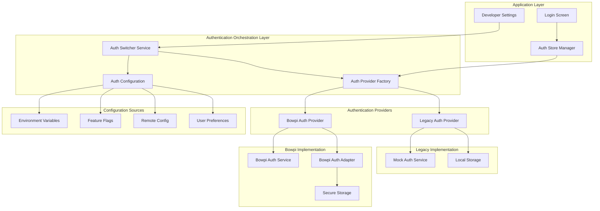
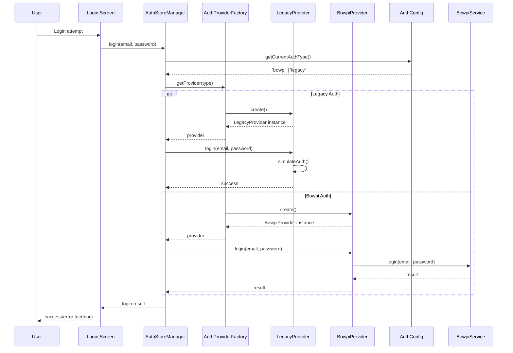

# Dual Authentication System - Design

## Overview

Este documento describe el diseño técnico para implementar un sistema de autenticación dual que permita alternar entre autenticación Legacy (simulada) y Bowpi (real) de forma dinámica, manteniendo compatibilidad total con la arquitectura existente.

## Architecture

### High-Level Architecture



### Component Interaction Flow



## Components and Interfaces

### 1. Core Interfaces

#### AuthProvider Interface
```typescript
export interface AuthProvider {
  readonly type: AuthType;
  readonly name: string;
  readonly description: string;
  
  // Core authentication methods
  login(email: string, password: string): Promise<LoginResult>;
  logout(): Promise<void>;
  isAuthenticated(): Promise<boolean>;
  getCurrentUser(): Promise<User | null>;
  
  // Lifecycle methods
  initialize(): Promise<void>;
  cleanup(): Promise<void>;
  
  // Provider-specific capabilities
  getCapabilities(): AuthProviderCapabilities;
  
  // Health and status
  healthCheck(): Promise<ProviderHealthStatus>;
  getDebugInfo(): ProviderDebugInfo;
}

export interface AuthProviderCapabilities {
  supportsOffline: boolean;
  supportsTokenRefresh: boolean;
  supportsPasswordReset: boolean;
  supportsBiometric: boolean;
  requiresNetwork: boolean;
  supportsMultipleUsers: boolean;
}

export interface ProviderHealthStatus {
  isHealthy: boolean;
  lastCheck: number;
  issues: string[];
  performance: {
    averageLoginTime: number;
    successRate: number;
    lastSuccessfulOperation: number;
  };
}
```

#### AuthConfiguration Interface
```typescript
export interface AuthConfiguration {
  currentType: AuthType;
  fallbackType?: AuthType;
  autoSwitchOnFailure: boolean;
  
  legacy: LegacyAuthConfig;
  bowpi: BowpiAuthConfig;
  
  // Runtime switching settings
  allowRuntimeSwitch: boolean;
  requireConfirmationForSwitch: boolean;
  
  // Monitoring and analytics
  enableMetrics: boolean;
  enableDebugLogging: boolean;
}

export interface LegacyAuthConfig {
  mockDelay: number;
  allowedUsers: string[];
  simulateNetworkErrors: boolean;
  offlineMode: boolean;
}

export interface BowpiAuthConfig {
  baseUrl: string;
  timeout: number;
  retryAttempts: number;
  enableEncryption: boolean;
}
```

### 2. Authentication Providers

#### Legacy Authentication Provider
```typescript
export class LegacyAuthProvider implements AuthProvider {
  readonly type = AuthType.LEGACY;
  readonly name = 'Legacy Authentication';
  readonly description = 'Simulated authentication for development and testing';
  
  private config: LegacyAuthConfig;
  private currentUser: User | null = null;
  private sessionData: LegacySessionData | null = null;
  
  constructor(config: LegacyAuthConfig) {
    this.config = config;
  }
  
  async login(email: string, password: string): Promise<LoginResult> {
    // Simulate network delay
    await this.simulateDelay();
    
    // Validate against allowed users or use default validation
    if (!this.isValidCredentials(email, password)) {
      return {
        success: false,
        message: 'Invalid credentials',
        error: new Error('Invalid email or password')
      };
    }
    
    // Create mock user data
    const userData = this.createMockUser(email);
    
    // Store session locally
    await this.storeSession(userData);
    
    this.currentUser = userData;
    
    return {
      success: true,
      message: 'Login successful',
      userData
    };
  }
  
  async logout(): Promise<void> {
    await this.clearSession();
    this.currentUser = null;
  }
  
  async isAuthenticated(): Promise<boolean> {
    if (this.currentUser) return true;
    
    // Check stored session
    const session = await this.loadSession();
    if (session && this.isSessionValid(session)) {
      this.currentUser = session.user;
      return true;
    }
    
    return false;
  }
  
  getCapabilities(): AuthProviderCapabilities {
    return {
      supportsOffline: true,
      supportsTokenRefresh: false,
      supportsPasswordReset: false,
      supportsBiometric: false,
      requiresNetwork: false,
      supportsMultipleUsers: true
    };
  }
  
  private async simulateDelay(): Promise<void> {
    if (this.config.mockDelay > 0) {
      await new Promise(resolve => setTimeout(resolve, this.config.mockDelay));
    }
  }
  
  private isValidCredentials(email: string, password: string): boolean {
    // If specific users are configured, validate against them
    if (this.config.allowedUsers.length > 0) {
      return this.config.allowedUsers.includes(email);
    }
    
    // Default validation - any email with password length > 3
    return email.includes('@') && password.length > 3;
  }
  
  private createMockUser(email: string): User {
    return {
      id: `legacy-${Date.now()}`,
      email,
      name: email.split('@')[0].replace(/[._]/g, ' ').replace(/\b\w/g, l => l.toUpperCase()),
      role: 'agent',
      profile: {
        provider: 'legacy',
        createdAt: new Date().toISOString(),
        lastLogin: new Date().toISOString()
      }
    };
  }
}
```

#### Bowpi Authentication Provider
```typescript
export class BowpiAuthProvider implements AuthProvider {
  readonly type = AuthType.BOWPI;
  readonly name = 'Bowpi Authentication';
  readonly description = 'Production Bowpi authentication system';
  
  private bowpiService: BowpiAuthService;
  private config: BowpiAuthConfig;
  
  constructor(config: BowpiAuthConfig) {
    this.config = config;
    this.bowpiService = new BowpiAuthService();
  }
  
  async initialize(): Promise<void> {
    await this.bowpiService.initialize();
  }
  
  async login(email: string, password: string): Promise<LoginResult> {
    return await this.bowpiService.login(email, password);
  }
  
  async logout(): Promise<void> {
    await this.bowpiService.logout();
  }
  
  async isAuthenticated(): Promise<boolean> {
    return await this.bowpiService.isAuthenticated();
  }
  
  async getCurrentUser(): Promise<User | null> {
    const bowpiUser = await this.bowpiService.getCurrentUser();
    if (!bowpiUser) return null;
    
    // Convert Bowpi user to standard User format
    return {
      id: bowpiUser.userId,
      email: bowpiUser.email,
      name: `${bowpiUser.userProfile.names} ${bowpiUser.userProfile.lastNames}`,
      role: this.mapBowpiRole(bowpiUser.roles),
      profile: {
        ...bowpiUser.userProfile,
        provider: 'bowpi'
      }
    };
  }
  
  getCapabilities(): AuthProviderCapabilities {
    return {
      supportsOffline: true,
      supportsTokenRefresh: true,
      supportsPasswordReset: false,
      supportsBiometric: false,
      requiresNetwork: true,
      supportsMultipleUsers: false
    };
  }
  
  async healthCheck(): Promise<ProviderHealthStatus> {
    // Implement health check for Bowpi services
    const networkStatus = this.bowpiService.getNetworkStatus();
    
    return {
      isHealthy: networkStatus.isConnected,
      lastCheck: Date.now(),
      issues: networkStatus.isConnected ? [] : ['Network connectivity required'],
      performance: {
        averageLoginTime: 2500, // Could be calculated from metrics
        successRate: 0.95,
        lastSuccessfulOperation: Date.now() - 60000
      }
    };
  }
  
  private mapBowpiRole(roles: string[]): 'agent' | 'supervisor' {
    const supervisorRoles = ['SUPERVISOR', 'MANAGER', 'ADMIN'];
    const hasSupervisorRole = roles.some(role => 
      supervisorRoles.some(supervisorRole => 
        role.toUpperCase().includes(supervisorRole)
      )
    );
    return hasSupervisorRole ? 'supervisor' : 'agent';
  }
}
```

### 3. Authentication Provider Factory

```typescript
export class AuthProviderFactory {
  private static providers: Map<AuthType, AuthProvider> = new Map();
  private static config: AuthConfiguration;
  
  static initialize(config: AuthConfiguration): void {
    this.config = config;
  }
  
  static async createProvider(type: AuthType): Promise<AuthProvider> {
    // Return cached provider if exists
    if (this.providers.has(type)) {
      return this.providers.get(type)!;
    }
    
    let provider: AuthProvider;
    
    switch (type) {
      case AuthType.LEGACY:
        provider = new LegacyAuthProvider(this.config.legacy);
        break;
        
      case AuthType.BOWPI:
        provider = new BowpiAuthProvider(this.config.bowpi);
        break;
        
      default:
        throw new Error(`Unknown authentication type: ${type}`);
    }
    
    // Initialize provider
    await provider.initialize();
    
    // Cache provider
    this.providers.set(type, provider);
    
    return provider;
  }
  
  static async switchProvider(newType: AuthType): Promise<AuthProvider> {
    // Cleanup current provider if exists
    const currentProvider = this.providers.get(this.config.currentType);
    if (currentProvider) {
      await currentProvider.cleanup();
      this.providers.delete(this.config.currentType);
    }
    
    // Create new provider
    const newProvider = await this.createProvider(newType);
    
    // Update configuration
    this.config.currentType = newType;
    
    return newProvider;
  }
  
  static getCurrentProvider(): AuthProvider | null {
    return this.providers.get(this.config.currentType) || null;
  }
  
  static async cleanup(): Promise<void> {
    for (const [type, provider] of this.providers) {
      await provider.cleanup();
    }
    this.providers.clear();
  }
}
```

### 4. Enhanced AuthStoreManager

```typescript
export class AuthStoreManager {
  private static instance: AuthStoreManager;
  private storeRef: AuthStoreInterface | null = null;
  private currentProvider: AuthProvider | null = null;
  private config: AuthConfiguration;
  private callbacks: AuthStoreCallback[] = [];
  
  private constructor() {
    this.loadConfiguration();
  }
  
  static getInstance(): AuthStoreManager {
    if (!AuthStoreManager.instance) {
      AuthStoreManager.instance = new AuthStoreManager();
    }
    return AuthStoreManager.instance;
  }
  
  async initialize(store: AuthStoreInterface): Promise<void> {
    console.log('🔍 [AUTH_STORE_MANAGER] Initializing with dual auth support');
    
    this.storeRef = store;
    
    // Initialize factory with configuration
    AuthProviderFactory.initialize(this.config);
    
    // Create initial provider
    this.currentProvider = await AuthProviderFactory.createProvider(this.config.currentType);
    
    console.log(`✅ [AUTH_STORE_MANAGER] Initialized with ${this.currentProvider.name}`);
  }
  
  async login(email: string, password: string): Promise<void> {
    if (!this.currentProvider) {
      throw new Error('Authentication provider not initialized');
    }
    
    console.log(`🔍 [AUTH_STORE_MANAGER] Login attempt using ${this.currentProvider.name}`);
    
    try {
      const result = await this.currentProvider.login(email, password);
      
      if (result.success && result.userData) {
        this.updateAuthState(result.userData);
        console.log(`✅ [AUTH_STORE_MANAGER] Login successful with ${this.currentProvider.name}`);
      } else {
        throw new Error(result.message || 'Login failed');
      }
    } catch (error) {
      console.error(`❌ [AUTH_STORE_MANAGER] Login failed with ${this.currentProvider.name}:`, error);
      
      // If auto-switch is enabled and we have a fallback, try it
      if (this.config.autoSwitchOnFailure && this.config.fallbackType) {
        console.log(`🔄 [AUTH_STORE_MANAGER] Attempting fallback to ${this.config.fallbackType}`);
        await this.switchAuthProvider(this.config.fallbackType);
        return this.login(email, password);
      }
      
      throw error;
    }
  }
  
  async logout(): Promise<void> {
    if (!this.currentProvider) return;
    
    console.log(`🔍 [AUTH_STORE_MANAGER] Logout using ${this.currentProvider.name}`);
    
    try {
      await this.currentProvider.logout();
      this.clearAuthState();
      console.log(`✅ [AUTH_STORE_MANAGER] Logout successful with ${this.currentProvider.name}`);
    } catch (error) {
      console.error(`❌ [AUTH_STORE_MANAGER] Logout error with ${this.currentProvider.name}:`, error);
      // Always clear local state even if server logout fails
      this.clearAuthState();
    }
  }
  
  async switchAuthProvider(newType: AuthType): Promise<void> {
    console.log(`🔄 [AUTH_STORE_MANAGER] Switching from ${this.config.currentType} to ${newType}`);
    
    try {
      // Logout from current provider
      if (this.currentProvider) {
        await this.currentProvider.logout();
      }
      
      // Switch to new provider
      this.currentProvider = await AuthProviderFactory.switchProvider(newType);
      
      // Update configuration
      this.config.currentType = newType;
      await this.saveConfiguration();
      
      // Clear auth state
      this.clearAuthState();
      
      console.log(`✅ [AUTH_STORE_MANAGER] Successfully switched to ${this.currentProvider.name}`);
      
      // Notify callbacks
      this.notifyCallbacks();
      
    } catch (error) {
      console.error(`❌ [AUTH_STORE_MANAGER] Failed to switch to ${newType}:`, error);
      throw error;
    }
  }
  
  getCurrentAuthType(): AuthType {
    return this.config.currentType;
  }
  
  getCurrentProvider(): AuthProvider | null {
    return this.currentProvider;
  }
  
  getAvailableProviders(): AuthType[] {
    return [AuthType.LEGACY, AuthType.BOWPI];
  }
  
  async getProviderCapabilities(): Promise<AuthProviderCapabilities | null> {
    return this.currentProvider?.getCapabilities() || null;
  }
  
  async getProviderHealth(): Promise<ProviderHealthStatus | null> {
    return this.currentProvider?.healthCheck() || null;
  }
  
  private async loadConfiguration(): Promise<void> {
    // Load from multiple sources with priority order
    const envType = process.env.AUTH_TYPE as AuthType;
    const storedType = await this.getStoredAuthType();
    const defaultType = AuthType.BOWPI;
    
    this.config = {
      currentType: envType || storedType || defaultType,
      fallbackType: envType ? undefined : AuthType.LEGACY,
      autoSwitchOnFailure: process.env.NODE_ENV === 'development',
      
      legacy: {
        mockDelay: parseInt(process.env.LEGACY_MOCK_DELAY || '1000'),
        allowedUsers: process.env.LEGACY_ALLOWED_USERS?.split(',') || [],
        simulateNetworkErrors: process.env.LEGACY_SIMULATE_ERRORS === 'true',
        offlineMode: true
      },
      
      bowpi: {
        baseUrl: process.env.BOWPI_BASE_URL || 'http://10.14.11.200:7161',
        timeout: parseInt(process.env.BOWPI_TIMEOUT || '30000'),
        retryAttempts: parseInt(process.env.BOWPI_RETRY_ATTEMPTS || '3'),
        enableEncryption: process.env.BOWPI_ENCRYPTION !== 'false'
      },
      
      allowRuntimeSwitch: process.env.NODE_ENV === 'development',
      requireConfirmationForSwitch: true,
      enableMetrics: true,
      enableDebugLogging: process.env.NODE_ENV === 'development'
    };
  }
  
  private async saveConfiguration(): Promise<void> {
    try {
      const AsyncStorage = await import('@react-native-async-storage/async-storage').then(m => m.default);
      await AsyncStorage.setItem('auth_provider_type', this.config.currentType);
    } catch (error) {
      console.error('Failed to save auth configuration:', error);
    }
  }
  
  private async getStoredAuthType(): Promise<AuthType | null> {
    try {
      const AsyncStorage = await import('@react-native-async-storage/async-storage').then(m => m.default);
      const stored = await AsyncStorage.getItem('auth_provider_type');
      return stored as AuthType || null;
    } catch (error) {
      console.error('Failed to load stored auth type:', error);
      return null;
    }
  }
}
```

## Data Models

### 1. Authentication Types

```typescript
export enum AuthType {
  LEGACY = 'legacy',
  BOWPI = 'bowpi'
}

export interface LoginResult {
  success: boolean;
  message: string;
  userData?: User;
  error?: Error;
  provider?: AuthType;
  duration?: number;
}

export interface User {
  id: string;
  email: string;
  name: string;
  role: 'agent' | 'supervisor';
  profile: {
    provider: 'legacy' | 'bowpi';
    createdAt?: string;
    lastLogin?: string;
    [key: string]: any;
  };
}
```

### 2. Configuration Models

```typescript
export interface AuthSwitchEvent {
  fromType: AuthType;
  toType: AuthType;
  timestamp: number;
  reason: 'user_request' | 'auto_fallback' | 'configuration_change';
  success: boolean;
  error?: string;
}

export interface AuthMetrics {
  currentProvider: AuthType;
  totalLogins: number;
  successfulLogins: number;
  failedLogins: number;
  averageLoginTime: number;
  providerSwitches: number;
  lastSwitch?: AuthSwitchEvent;
  providerStats: {
    [key in AuthType]: {
      usage: number;
      successRate: number;
      averageResponseTime: number;
    };
  };
}
```

## Testing Strategy

### 1. Unit Testing

```typescript
describe('AuthProviderFactory', () => {
  it('should create legacy provider correctly', async () => {
    const config = createMockConfig();
    AuthProviderFactory.initialize(config);
    
    const provider = await AuthProviderFactory.createProvider(AuthType.LEGACY);
    
    expect(provider.type).toBe(AuthType.LEGACY);
    expect(provider.name).toBe('Legacy Authentication');
  });
  
  it('should switch providers correctly', async () => {
    const config = createMockConfig();
    AuthProviderFactory.initialize(config);
    
    // Start with legacy
    await AuthProviderFactory.createProvider(AuthType.LEGACY);
    
    // Switch to Bowpi
    const newProvider = await AuthProviderFactory.switchProvider(AuthType.BOWPI);
    
    expect(newProvider.type).toBe(AuthType.BOWPI);
  });
});

describe('LegacyAuthProvider', () => {
  it('should authenticate with valid credentials', async () => {
    const config = { mockDelay: 0, allowedUsers: [], simulateNetworkErrors: false, offlineMode: true };
    const provider = new LegacyAuthProvider(config);
    
    const result = await provider.login('test@example.com', 'password123');
    
    expect(result.success).toBe(true);
    expect(result.userData?.email).toBe('test@example.com');
  });
  
  it('should reject invalid credentials', async () => {
    const config = { mockDelay: 0, allowedUsers: ['allowed@test.com'], simulateNetworkErrors: false, offlineMode: true };
    const provider = new LegacyAuthProvider(config);
    
    const result = await provider.login('invalid@example.com', 'password123');
    
    expect(result.success).toBe(false);
  });
});
```

### 2. Integration Testing

```typescript
describe('Dual Authentication Integration', () => {
  it('should complete full authentication flow with legacy', async () => {
    // Setup
    const authManager = AuthStoreManager.getInstance();
    await authManager.switchAuthProvider(AuthType.LEGACY);
    
    // Test login
    await authManager.login('test@example.com', 'password123');
    
    // Verify state
    const state = authManager.getState();
    expect(state.isAuthenticated).toBe(true);
    expect(state.user?.email).toBe('test@example.com');
  });
  
  it('should switch providers during runtime', async () => {
    const authManager = AuthStoreManager.getInstance();
    
    // Start with legacy
    await authManager.switchAuthProvider(AuthType.LEGACY);
    expect(authManager.getCurrentAuthType()).toBe(AuthType.LEGACY);
    
    // Switch to Bowpi
    await authManager.switchAuthProvider(AuthType.BOWPI);
    expect(authManager.getCurrentAuthType()).toBe(AuthType.BOWPI);
  });
});
```

## Performance Considerations

### 1. Provider Caching
- **Singleton providers** para evitar recreación innecesaria
- **Lazy initialization** de proveedores no utilizados
- **Resource cleanup** al cambiar proveedores

### 2. Configuration Loading
- **Cached configuration** para evitar lecturas repetidas
- **Async configuration loading** para no bloquear UI
- **Configuration validation** en tiempo de carga

### 3. State Management
- **Minimal state updates** durante switching
- **Batch updates** para cambios múltiples
- **Optimistic updates** donde sea apropiado

## Security Considerations

### 1. Provider Isolation
- **Separate storage** para cada proveedor
- **Clean transitions** sin data leakage
- **Secure cleanup** de datos sensibles

### 2. Configuration Security
- **Environment variable validation**
- **Secure storage** de preferencias
- **Access control** para switching

### 3. Audit Trail
- **Complete logging** de cambios de proveedor
- **Security events** para switches sospechosos
- **Metrics collection** para análisis

## Migration Strategy

### 1. Gradual Rollout
1. **Phase 1**: Implementar sistema dual con Bowpi como default
2. **Phase 2**: Habilitar switching en desarrollo
3. **Phase 3**: Permitir switching en staging
4. **Phase 4**: Rollout gradual en producción

### 2. Fallback Strategy
- **Automatic fallback** en caso de errores críticos
- **Manual override** para administradores
- **Health monitoring** para decisiones automáticas

### 3. Data Migration
- **Session preservation** durante switches
- **Configuration migration** de versiones anteriores
- **Cleanup procedures** para datos obsoletos