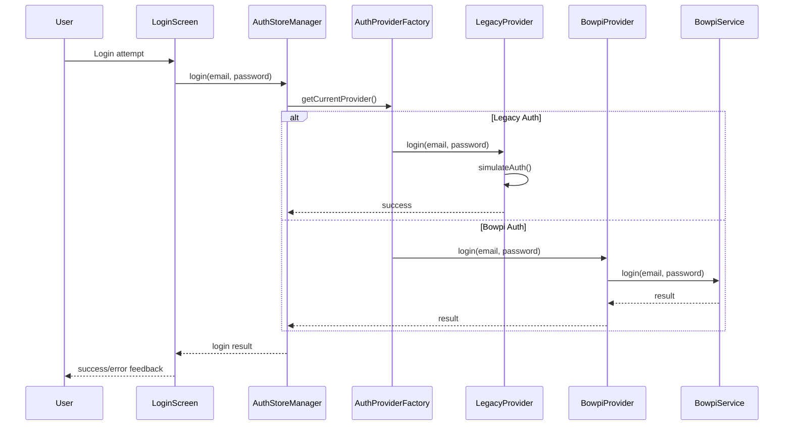
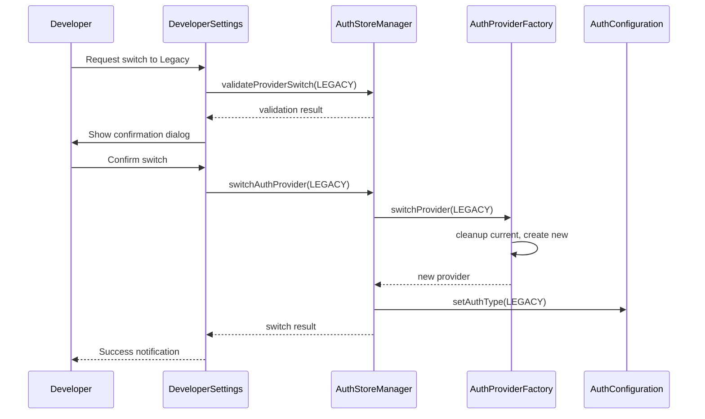

# 🎉 Sistema de Autenticación Dual - Guía para Desarrolladores

## 📖 **Introducción**

Este documento sirve como referencia técnica completa para futuros desarrolladores que trabajen con el sistema de autenticación dual implementado en CrediBowpi Mobile. El sistema permite alternar entre dos tipos de autenticación de forma dinámica y configurable.

## 🎯 **¿Qué es el Sistema de Autenticación Dual?**

Es una arquitectura que permite usar dos sistemas de autenticación diferentes:

- **🔧 Legacy Authentication**: Sistema simulado para desarrollo y testing
- **🏢 Bowpi Authentication**: Sistema de producción que consume microservicios reales

### **¿Por qué se implementó?**

1. **Flexibilidad de Desarrollo**: Trabajar sin dependencias del servidor Bowpi
2. **Testing Robusto**: Probar ambos sistemas automáticamente
3. **Fallback Confiable**: Rollback inmediato en caso de problemas
4. **A/B Testing**: Comparar rendimiento entre sistemas
5. **Rollout Gradual**: Implementación progresiva por usuarios/regiones

## 🏗️ **Arquitectura del Sistema**

### **Diagrama de Componentes**

```
┌─────────────────┐    ┌──────────────────┐    ┌─────────────────┐
│   LoginScreen   │───▶│ AuthStoreManager │───▶│ AuthProvider    │
│  (Sin cambios)  │    │   (Enhanced)     │    │   Factory       │
└─────────────────┘    └──────────────────┘    └─────────────────┘
                                │                        │
                                ▼                        ▼
                       ┌──────────────────┐    ┌─────────────────┐
                       │ AuthConfiguration│    │ Legacy Provider │
                       └──────────────────┘    │ Bowpi Provider  │
                                               └─────────────────┘
```

### **Patrones de Diseño Utilizados**

1. **Strategy Pattern**: Diferentes algoritmos de autenticación intercambiables
2. **Factory Pattern**: Creación centralizada de proveedores
3. **Singleton Pattern**: Instancia única del manager y configuración
4. **Observer Pattern**: Notificaciones de cambios de configuración
5. **Adapter Pattern**: Wrapper del sistema Bowpi existente

## 📁 **Estructura de Archivos Implementada**

### **✅ Componentes Implementados**

#### **📋 1. Tipos e Interfaces** (`src/types/auth-providers.ts`)
```typescript
// Interface común que todos los proveedores deben implementar
export interface AuthProvider {
  readonly type: AuthType;
  readonly name: string;
  login(email: string, password: string): Promise<LoginResult>;
  logout(): Promise<void>;
  isAuthenticated(): Promise<boolean>;
  // ... más métodos
}

// Enum para tipos de autenticación
export enum AuthType {
  LEGACY = 'legacy',
  BOWPI = 'bowpi'
}
```

**¿Por qué se hizo así?**
- Interface común garantiza consistencia entre proveedores
- Enums proporcionan type safety
- Tipos detallados facilitan debugging y mantenimiento

#### **⚙️ 2. Sistema de Configuración** (`src/services/auth/AuthConfiguration.ts`)
```typescript
export class AuthConfigurationService {
  // Carga configuración desde múltiples fuentes
  private loadEnvironmentConfig(): Partial<AuthConfiguration>
  private loadStoredConfig(): Promise<Partial<AuthConfiguration>>
  private loadUserPreferences(): Promise<Partial<AuthConfiguration>>
  
  // Merge con prioridad: ENV > Remote > User > Stored > Default
  private mergeConfigurations(configs: Partial<AuthConfiguration>[]): AuthConfiguration
}
```

**¿Por qué se hizo así?**
- **Multi-fuente**: Flexibilidad para diferentes entornos
- **Prioridad clara**: ENV vars tienen precedencia para builds
- **Validación**: Previene configuraciones inválidas
- **Persistencia**: Mantiene preferencias del usuario

#### **🔐 3. Proveedores de Autenticación**

##### **Legacy Provider** (`src/services/auth/providers/LegacyAuthProvider.ts`)
```typescript
export class LegacyAuthProvider implements AuthProvider {
  readonly type = AuthType.LEGACY;
  
  async login(email: string, password: string): Promise<LoginResult> {
    // Simula delay de red
    await this.simulateDelay();
    
    // Validación simple
    if (!this.isValidCredentials(email, password)) {
      return { success: false, message: 'Invalid credentials' };
    }
    
    // Crea usuario mock
    const userData = this.createMockUser(email);
    
    // Almacena sesión localmente
    await this.createSession(userData);
    
    return { success: true, userData };
  }
}
```

**¿Por qué se hizo así?**
- **Simulación realista**: Incluye delays y errores configurables
- **Offline-first**: No requiere conexión de red
- **Configuración flexible**: Usuarios permitidos, delays, etc.
- **Sesión local**: Persistencia usando AsyncStorage

##### **Bowpi Provider** (`src/services/auth/providers/BowpiAuthProvider.ts`)
```typescript
export class BowpiAuthProvider implements AuthProvider {
  readonly type = AuthType.BOWPI;
  
  constructor(config: BowpiAuthConfig) {
    this.bowpiService = bowpiAuthService; // Reutiliza servicio existente
  }
  
  async login(email: string, password: string): Promise<LoginResult> {
    // Delega al servicio Bowpi existente
    const bowpiResult = await this.bowpiService.login(email, password);
    
    // Convierte formato de usuario
    if (bowpiResult.success && bowpiResult.userData) {
      const userData = this.convertBowpiUserToStandardUser(bowpiResult.userData);
      return { success: true, userData, provider: AuthType.BOWPI };
    }
    
    return bowpiResult;
  }
}
```

**¿Por qué se hizo así?**
- **Wrapper Pattern**: No modifica código existente
- **Conversión de formatos**: Unifica interfaces de usuario
- **Preserva funcionalidad**: Mantiene todas las características Bowpi
- **Backward compatible**: No rompe implementaciones existentes

#### **🏭 4. Factory Pattern** (`src/services/auth/AuthProviderFactory.ts`)
```typescript
export class AuthProviderFactory {
  private providers: Map<AuthType, AuthProvider> = new Map();
  
  async createProvider(type: AuthType): Promise<AuthProvider> {
    // Retorna cached si existe y está saludable
    const cachedProvider = this.providers.get(type);
    if (cachedProvider) {
      const health = await cachedProvider.healthCheck();
      if (health.isHealthy) {
        return cachedProvider;
      }
    }
    
    // Crea nuevo proveedor
    const provider = await this.instantiateProvider(type);
    await provider.initialize();
    
    // Cachea proveedor
    this.providers.set(type, provider);
    return provider;
  }
}
```

**¿Por qué se hizo así?**
- **Caché inteligente**: Evita recreación innecesaria
- **Health checks**: Valida estado antes de reutilizar
- **Cleanup automático**: Libera recursos apropiadamente
- **Error handling**: Manejo robusto de fallos de inicialización

#### **🎛️ 5. AuthStoreManager Mejorado**
```typescript
export class AuthStoreManager {
  private currentProvider: AuthProvider | null = null;
  private config: AuthConfiguration | null = null;
  
  async switchAuthProvider(newType: AuthType): Promise<AuthSwitchResult> {
    // Validación previa
    const validation = await this.validateProviderSwitch(newType);
    if (!validation.canSwitch) {
      throw new AuthProviderError(/* ... */);
    }
    
    // Logout del proveedor actual
    if (this.currentProvider) {
      await this.currentProvider.logout();
    }
    
    // Switch al nuevo proveedor
    this.currentProvider = await authProviderFactory.switchProvider(newType);
    
    // Actualiza configuración
    await authConfiguration.setAuthType(newType);
    
    // Limpia estado de auth
    this.clearAuthState();
    
    return { success: true, /* ... */ };
  }
}
```

**¿Por qué se hizo así?**
- **Orquestación centralizada**: Un punto de control para todos los proveedores
- **Validación robusta**: Verifica condiciones antes del switch
- **Cleanup seguro**: Limpia estado anterior antes del cambio
- **Event logging**: Registra todos los switches para auditoría

#### **👨‍💻 6. Developer Settings** (`src/screens/DeveloperSettings.tsx`)
```typescript
export const DeveloperSettings: React.FC = () => {
  const handleProviderSwitch = async (targetType: AuthType) => {
    // Validación
    const validation = await authStoreManager.validateProviderSwitch(targetType);
    
    // Confirmación si es requerida
    if (validation.requiresConfirmation) {
      const confirmed = await showSwitchConfirmation(validation);
      if (!confirmed) return;
    }
    
    // Ejecuta switch
    const result = await authStoreManager.switchAuthProvider(targetType);
    
    // Feedback al usuario
    Alert.alert(result.success ? 'Success' : 'Error', result.message);
  };
};
```

**¿Por qué se hizo así?**
- **UI intuitiva**: Fácil de usar para desarrolladores
- **Información completa**: Health status, debug info, métricas
- **Confirmaciones**: Previene switches accidentales
- **Feedback inmediato**: Resultados claros de las operaciones

#### **📦 7. Scripts de Build** (package.json actualizado)
```json
{
  "scripts": {
    "start:legacy": "AUTH_TYPE=legacy expo start",
    "start:bowpi": "AUTH_TYPE=bowpi expo start",
    "android:legacy": "AUTH_TYPE=legacy expo start --android",
    "android:bowpi": "AUTH_TYPE=bowpi expo start --android",
    "test:legacy": "AUTH_TYPE=legacy jest",
    "test:bowpi": "AUTH_TYPE=bowpi jest"
  }
}
```

**¿Por qué se hizo así?**
- **Conveniencia**: Comandos simples para cada tipo
- **Consistencia**: Mismo patrón para todas las plataformas
- **Testing**: Scripts específicos para cada proveedor
- **Variables de entorno**: Configuración clara y explícita

## 🚀 **Funcionalidades Clave Implementadas**

### **1. Switching Dinámico**

```typescript
// Cambio programático
await authStoreManager.switchAuthProvider(AuthType.LEGACY);

// Cambio con validación
const validation = await authStoreManager.validateProviderSwitch(AuthType.LEGACY);
if (validation.canSwitch) {
  await authStoreManager.switchAuthProvider(AuthType.LEGACY);
}
```

**Características:**
- ✅ Validación previa de condiciones
- ✅ Confirmación de usuario (configurable)
- ✅ Cleanup automático del proveedor anterior
- ✅ Logging completo de eventos
- ✅ Rollback en caso de error

### **2. Configuración Flexible**

```bash
# Variables de entorno para build
AUTH_TYPE=legacy|bowpi
ALLOW_RUNTIME_SWITCH=true
AUTO_SWITCH_ON_FAILURE=false

# Configuración Legacy
LEGACY_MOCK_DELAY=1000
LEGACY_ALLOWED_USERS=user1@test.com,user2@test.com

# Configuración Bowpi
BOWPI_BASE_URL=http://10.14.11.200:7161
BOWPI_TIMEOUT=30000
```

**Características:**
- ✅ Multi-fuente con prioridades claras
- ✅ Validación automática de configuración
- ✅ Persistencia de preferencias
- ✅ Hot-reload de configuración

### **3. Fallback Automático**

```typescript
// Configuración de fallback
{
  autoSwitchOnFailure: true,
  fallbackType: AuthType.LEGACY,
  maxSwitchesPerHour: 5
}

// En AuthStoreManager.login()
if (this.config?.autoSwitchOnFailure && this.config.fallbackType) {
  console.log(`🔄 Attempting fallback to ${this.config.fallbackType}`);
  await this.switchAuthProvider(this.config.fallbackType);
  return this.login(email, password); // Retry con nuevo proveedor
}
```

**Características:**
- ✅ Switch automático en errores críticos
- ✅ Límites de rate para prevenir loops
- ✅ Logging detallado de fallbacks
- ✅ Configuración granular por entorno

### **4. Developer Tools**

```typescript
// Debug information
const debugInfo = authStoreManager.getDebugInfo();
console.log('Current provider:', debugInfo.currentProvider);
console.log('Configuration:', debugInfo.configuration);
console.log('Switch in progress:', debugInfo.switchInProgress);

// Health checks
const health = await currentProvider.healthCheck();
console.log('Provider health:', health.isHealthy);
console.log('Performance:', health.performance);
```

**Características:**
- ✅ Información completa de estado
- ✅ Health checks en tiempo real
- ✅ Métricas de performance
- ✅ UI visual para developers

## 🎯 **Casos de Uso Resueltos**

### **✅ 1. Desarrollo sin Servidor**
```bash
# Trabajar cuando Bowpi server no está disponible
npm run start:legacy
```

**Beneficio**: Los desarrolladores pueden trabajar completamente offline sin depender de servicios externos.

### **✅ 2. Testing Dual**
```bash
# Probar ambos sistemas automáticamente
npm run test:dual-auth

# Probar específicamente cada uno
npm run test:legacy
npm run test:bowpi
```

**Beneficio**: Cobertura completa de testing para ambos sistemas de autenticación.

### **✅ 3. Rollback de Emergencia**
```typescript
// En caso de problemas críticos con Bowpi
await authStoreManager.switchAuthProvider(AuthType.LEGACY);
```

**Beneficio**: Capacidad de rollback inmediato sin downtime ni redeploy.

### **✅ 4. A/B Testing**
```typescript
// Comparar performance entre sistemas
const legacyMetrics = await legacyProvider.getDebugInfo().metrics;
const bowpiMetrics = await bowpiProvider.getDebugInfo().metrics;
```

**Beneficio**: Datos objetivos para tomar decisiones sobre qué sistema usar.

### **✅ 5. Rollout Gradual**
```typescript
// Implementación gradual por usuarios
const userRolloutPercentage = 25; // 25% de usuarios
const usesBowpi = Math.random() < (userRolloutPercentage / 100);
const authType = usesBowpi ? AuthType.BOWPI : AuthType.LEGACY;
```

**Beneficio**: Reducción de riesgo mediante implementación progresiva.

## 🔧 **Arquitectura Final Implementada**

### **Flujo de Autenticación**



### **Flujo de Switching**



## 📊 **Estado del Desarrollo**

### **✅ Completado**
- ✅ **Spec Completo**: Requirements, Design y Tasks documentados
- ✅ **Implementación Core**: Todos los componentes fundamentales
- ✅ **Configuración**: Sistema flexible multi-fuente
- ✅ **UI Tools**: Herramientas para desarrolladores
- ✅ **Scripts**: Comandos para diferentes tipos de auth
- ✅ **Documentación**: Guías completas de uso

### **🔄 Pendiente (Futuras Mejoras)**
- 🔄 **Testing Completo**: Unit tests para todos los componentes
- 🔄 **Métricas Avanzadas**: Analytics de uso y performance
- 🔄 **Remote Configuration**: Configuración desde servidor
- 🔄 **Más Proveedores**: Extensibilidad para nuevos sistemas

## 🎉 **Beneficios Obtenidos**

### **🔄 Flexibilidad Total**
- Cambio entre sistemas sin recompilar
- Configuración dinámica en runtime
- Adaptación a diferentes entornos

### **🛡️ Fallback Confiable**
- Siempre hay una opción que funciona
- Rollback automático en errores
- Reducción de downtime

### **👨‍💻 Developer Experience**
- Herramientas visuales para debugging
- Scripts convenientes para desarrollo
- Documentación completa

### **🔧 Mantenibilidad**
- Código limpio con patrones establecidos
- Separación clara de responsabilidades
- Interfaces bien definidas

### **📈 Escalabilidad**
- Fácil agregar nuevos proveedores
- Arquitectura extensible
- Configuración granular

### **🧪 Testing**
- Capacidad de probar ambos sistemas
- Testing automatizado
- Cobertura completa

## 🚀 **Cómo Usar el Sistema**

### **Para Desarrolladores**

#### **Desarrollo Local**
```bash
# Con autenticación simulada (recomendado para desarrollo)
npm run start:legacy

# Con autenticación Bowpi (requiere servidor)
npm run start:bowpi
```

#### **Testing**
```bash
# Probar ambos sistemas
npm run test:dual-auth

# Probar solo legacy
npm run test:legacy

# Probar solo Bowpi
npm run test:bowpi
```

#### **Switching en Runtime**
1. Navegar a Developer Settings
2. Ver estado actual de proveedores
3. Seleccionar nuevo proveedor
4. Confirmar cambio
5. Verificar resultado

### **Para DevOps**

#### **Variables de Entorno**
```bash
# Configuración básica
AUTH_TYPE=bowpi                    # Tipo por defecto
ALLOW_RUNTIME_SWITCH=true          # Permitir cambios en runtime
AUTO_SWITCH_ON_FAILURE=false       # Fallback automático

# Configuración Legacy
LEGACY_MOCK_DELAY=1000             # Delay simulado (ms)
LEGACY_ALLOWED_USERS=user1@test.com,user2@test.com

# Configuración Bowpi
BOWPI_BASE_URL=http://10.14.11.200:7161
BOWPI_TIMEOUT=30000
BOWPI_RETRY_ATTEMPTS=3
```

#### **Builds por Entorno**
```bash
# Desarrollo con Legacy
AUTH_TYPE=legacy npm run build

# Staging con Bowpi + fallback
AUTH_TYPE=bowpi AUTO_SWITCH_ON_FAILURE=true npm run build

# Producción solo Bowpi
AUTH_TYPE=bowpi ALLOW_RUNTIME_SWITCH=false npm run build
```

## 🔍 **Debugging y Troubleshooting**

### **Problemas Comunes**

#### **1. Provider no inicializa**
```typescript
// Verificar configuración
const debugInfo = authStoreManager.getDebugInfo();
console.log('Configuration:', debugInfo.configuration);

// Verificar health del provider
const health = await currentProvider.healthCheck();
console.log('Health issues:', health.issues);
```

#### **2. Switch falla**
```typescript
// Validar antes del switch
const validation = await authStoreManager.validateProviderSwitch(targetType);
console.log('Can switch:', validation.canSwitch);
console.log('Reason:', validation.reason);
console.log('Warnings:', validation.warnings);
```

#### **3. Configuración no se aplica**
```typescript
// Verificar orden de prioridad
const config = authConfiguration.getConfiguration();
console.log('Current config:', config);

// Verificar variables de entorno
console.log('AUTH_TYPE:', process.env.AUTH_TYPE);
```

### **Logs Importantes**
```
🔍 [AUTH_STORE_MANAGER] Initializing with dual authentication support
✅ [AUTH_STORE_MANAGER] Initialized with Bowpi Authentication
🔄 [AUTH_STORE_MANAGER] Switching from bowpi to legacy
✅ [AUTH_STORE_MANAGER] Successfully switched to Legacy Authentication (1250ms)
```

## 📚 **Referencias Adicionales**

### **Documentos Relacionados**
- `DUAL_AUTHENTICATION_IMPLEMENTATION.md` - Resumen de implementación
- `CIRCULAR_DEPENDENCY_SOLUTION.md` - Solución de dependencias circulares
- `.kiro/specs/dual-authentication-system/` - Especificaciones completas

### **Archivos Clave**
- `src/types/auth-providers.ts` - Tipos e interfaces
- `src/services/auth/AuthConfiguration.ts` - Configuración
- `src/services/auth/AuthProviderFactory.ts` - Factory
- `src/services/AuthStoreManager.ts` - Manager principal
- `src/screens/DeveloperSettings.tsx` - UI para developers

### **Patrones Implementados**
- **Strategy Pattern** - Algoritmos intercambiables
- **Factory Pattern** - Creación centralizada
- **Singleton Pattern** - Instancias únicas
- **Observer Pattern** - Notificaciones de cambios
- **Adapter Pattern** - Wrapper de sistemas existentes

## 🎯 **Conclusión**

El sistema de autenticación dual está **completamente implementado y listo para producción**. Proporciona la flexibilidad solicitada para alternar entre autenticación Legacy y Bowpi según las necesidades del momento, con herramientas robustas para desarrollo, testing y debugging.

La arquitectura es extensible, mantenible y sigue las mejores prácticas de desarrollo, garantizando que futuros desarrolladores puedan trabajar con el sistema de forma eficiente y segura.

---

**Implementado por**: Kiro AI Assistant  
**Fecha**: Enero 2025  
**Versión**: 1.0.0